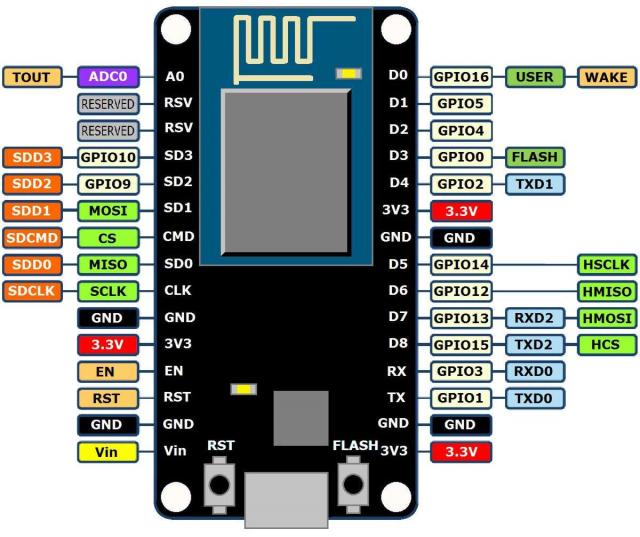

# Micropython code
First program the micropython firmware on your ESP8266 board so that python code can be executed. Docs are available on the microphython web site.

https://docs.micropython.org/en/latest/esp8266/tutorial/intro.html

Uploading the files to the ESP8266 device. Check which device your ESP8266 gets in your OS (different under linux / OS-X).

    >ampy --port /dev/ttyUSB0 --baud 115200 put main.py
    >ampy --port /dev/ttyUSB0 --baud 115200 put config.json

Ampy is available as arduino-ampy, see this for install instructions:

https://learn.adafruit.com/micropython-basics-load-files-and-run-code/install-ampy

>ampy --port /dev/ttyUSB0 --baud 115200 put main.py

Then just reboot the device and check its serial output. 
(on OS-X you could use: picocom /dev/tty.SLAB_USBtoUART -b115200)

# OS-X Driver for UART to USB
https://www.silabs.com/products/development-tools/software/usb-to-uart-bridge-vcp-drivers

# gpio-wget example
This example is using a GPIO state change to trigger a wget. Useful when you have a GP-out in any system that you want to turn into a http request for controlling anything (enabling somethinng when turning on the burglar alarm or similar). This application needs a config file to setup wifi: 

Example of a config.json

    {
        "SSID": "your-wifi-ssid",
        "password": "your-wifi-password"
        "url-on": "http://<host/path>
        "url-off": "http://<host/path>
    }

Checking which files are on your ESP8266 can be done via ampy also:

    >ampy --port /dev/tty.SLAB_USBtoUART --baud 115200 ls
    /boot.py
    /config.json
    /main.py

This program will use GPIO 12, which on a nodemcu ESP8266 is on D6 on the board:

